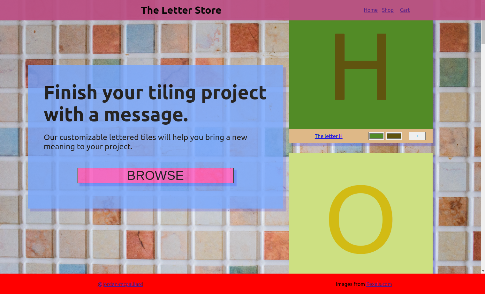
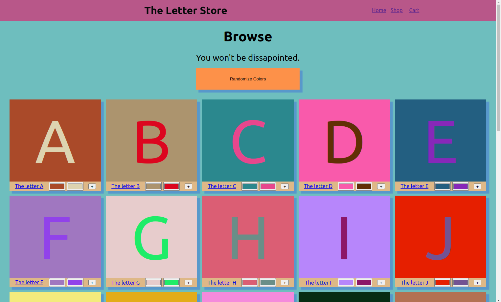
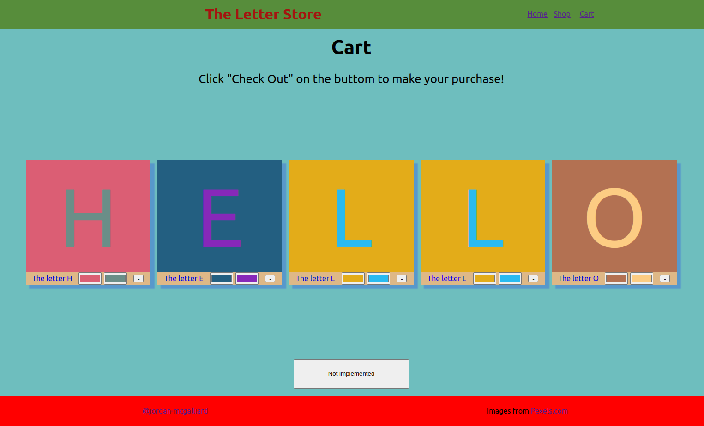
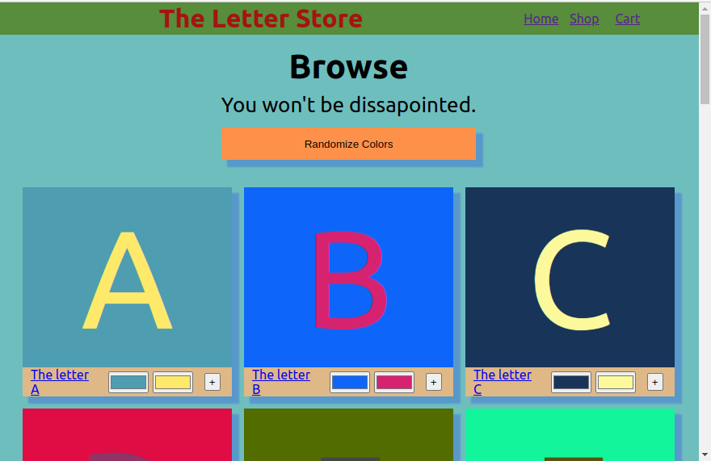
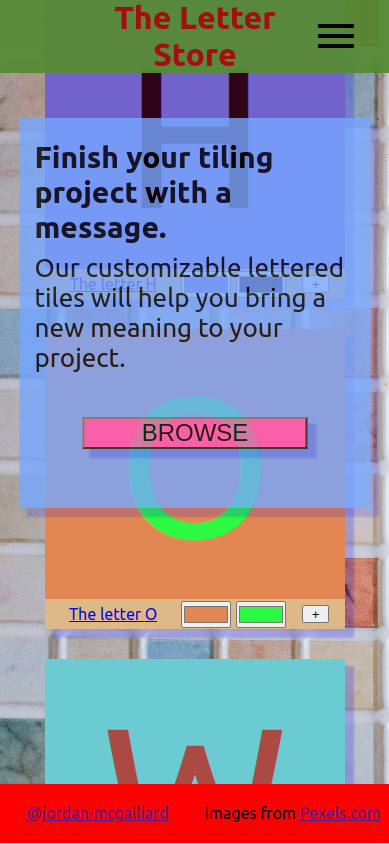
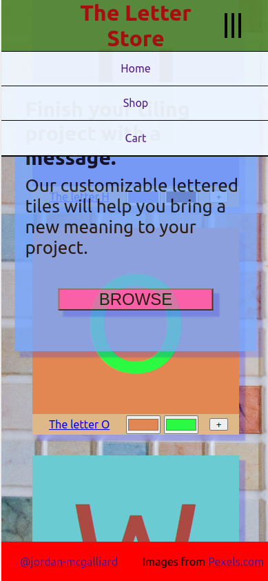
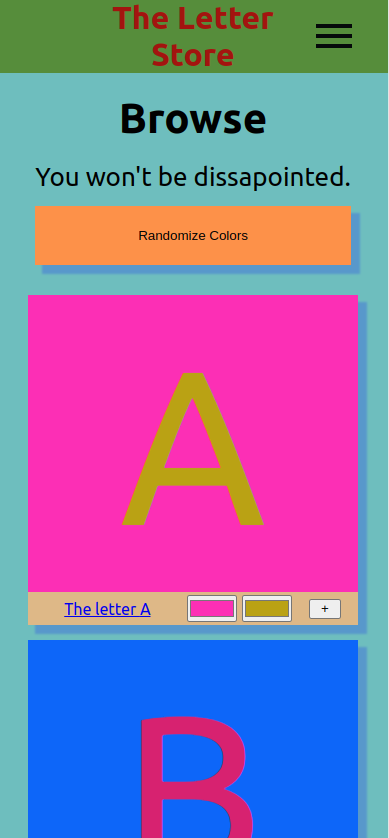

# Jordan McGalliard Portfolio

The projects in this portfolio show my progression from knowing almost nothing about Web Development (the bottom of the portfolio) to my current level (the top.) I have been learning Web Development during my freetime while working, travelling, and living my life.

## The Letter Store 9/10/2022

My first project that I tried to make  responsive to a reasonable degree. I learned so much about React and more advanced CSS techniques during this project.

### Features

It includes a homepage, a shop, and a cart where users can add/remove items. 

### Technologies Used

- React
- React Router
- JavaScript, CSS, HTML
- Git, GitHub
- Linux, Linux Command Line

### Images

### Images (click to expand)

## Landmarks Memory Game

A memory game where you try to select 12 landmarks without choosing the same one twice. My first real project using React. I encountered many newby React problems while doing this project and learned a lot while making everything work.

### Links

[Live Website]()
[GitHub Repo]()

### Features

- 4 of 12 possible cards displayed semi-randomly, such that you always have a unpicked card to pick
- A countdown of how many more unique cards you need to pick to win
- A "Play Again" button to press upon winning
- Game automatically resets when you click on the same card for the second time in a round
- Changing landscape backgrounds (performance can vary based on browser, internet connection, etc.)

### Technologies Used 

- React
- JavaScript, CSS, HTML
- Git, GitHub
- Linux, Linux Command Line

### Images 

