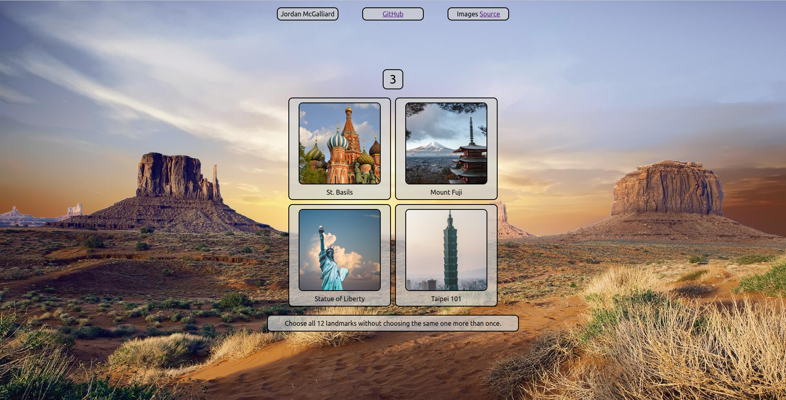
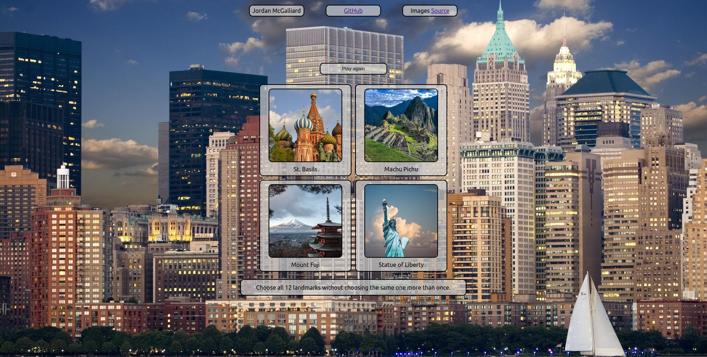
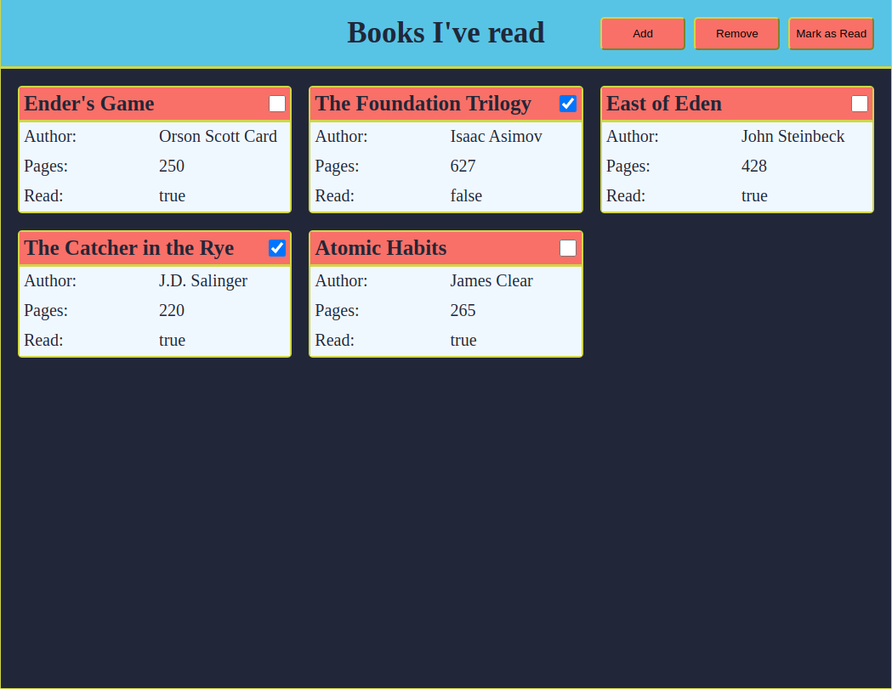
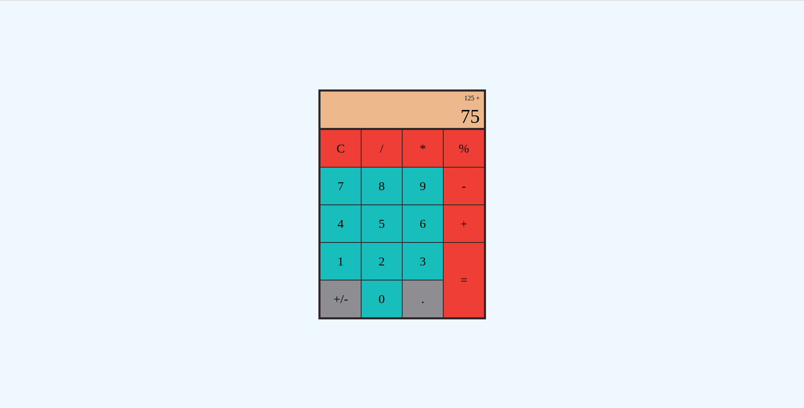
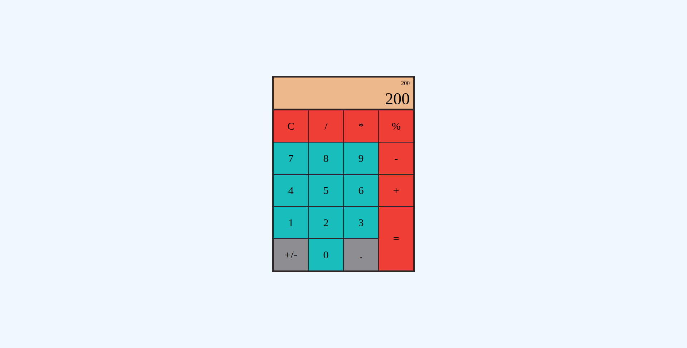
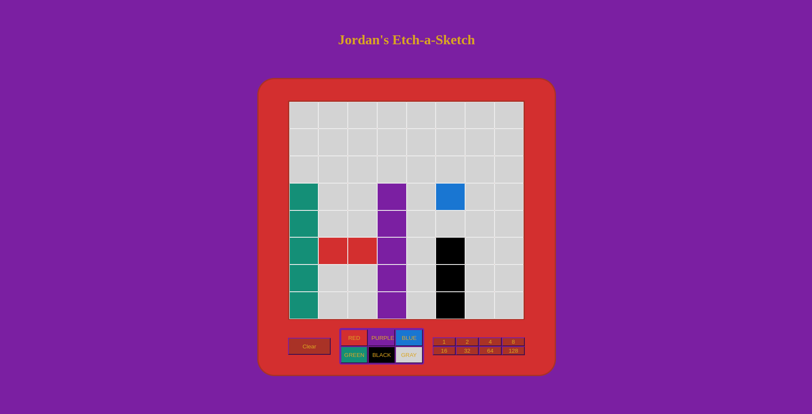
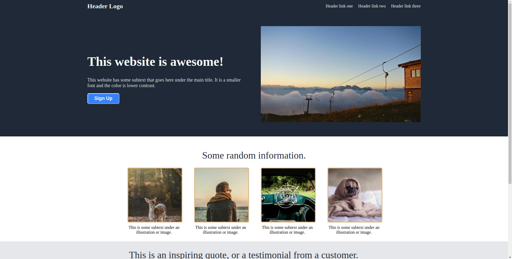
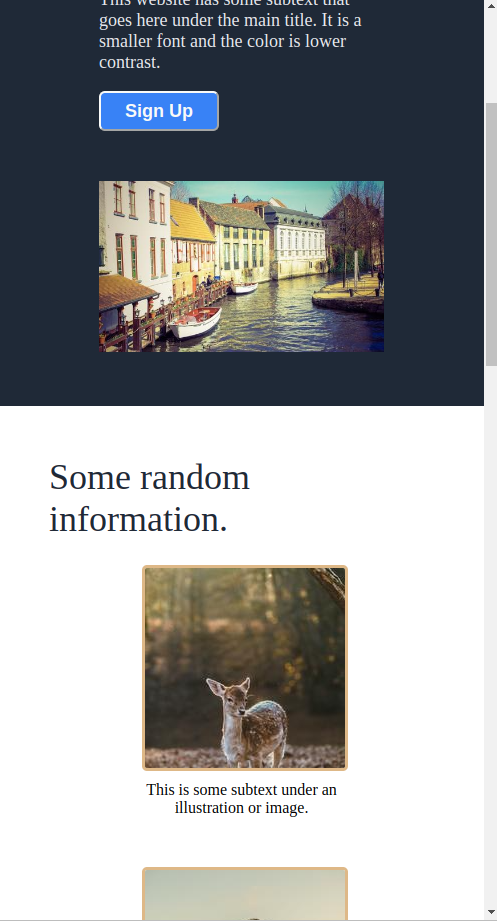

# Jordan McGalliard Portfolio

The projects in this portfolio show my progression from knowing almost nothing about Web Development (the bottom of the portfolio) to my current level (the top.) I have been learning Web Development during my freetime while working, travelling, and living my life.   

This doesn't include all the projects I've ever done.

## **6. The Letter Store 9/10/2022**

My first project that I tried to make  responsive to a reasonable degree. I learned so much about React and more advanced CSS techniques during this project. Users select and customize tiles that could be used in home improvement projects.

### Links

[Live Website](https://jordan-mcgalliard.github.io/the-letter-store/) 
[GitHub Repo](https://github.com/jordan-mcgalliard/the-letter-store/)

### Features

- Responsive to a reasonable degree
- A homepage with a "Browse" button leading to the shop
- Links to different parts of the website using React Router and Link components
- The background of the homepage is scrollable, so people can see what the tiles might look like. They spell out "Howdy Partner." (That's what we say in Wyoming)
- A toggle-able top menu when the screen is less than 750px wide. I made it with CSS positioning, transform, & transitions.
- A 'Shop' page where users can look at all the different letters and customize their colors. 
- A fun 'Randomize Color' button on the shop page, which changes the colors of many different elements and most importantly the tiles that users can choose from. The colors stay changed on subsequent page visits.
- The ability to add and remove tiles from the cart

### Technologies Used

- React
- React Router
- JavaScript, CSS, HTML
- Git, GitHub
- Linux, Linux Command Line

### Images

Click here to show images

## **5. Landmarks Memory Game 8/15/2022**

A memory game where you try to select 12 landmarks without choosing the same one twice. My first real project using React. I encountered many newby React problems while doing this project and learned a lot while making everything work.

### Links

[Live Website](https://jordan-mcgalliard.github.io/landmarks-memory-game/) 
[GitHub Repo](https://github.com/jordan-mcgalliard/landmarks-memory-game)

### Features

- 4 of 12 possible cards displayed semi-randomly, such that you always have a unpicked card to pick
- A countdown of how many more unique cards you need to pick to win
- A "Play Again" button to press upon winning
- Game automatically resets when you click on the same card for the second time in a round
- Changing landscape backgrounds (performance can vary based on browser, internet connection, etc.)

### Technologies Used 

- React
- JavaScript, CSS, HTML
- Git, GitHub
- Linux, Linux Command Line

### Images 

Click here to show images

## **4. Library 01/04/2022**

A reading checklist website made to practice my HTML, CSS, and JavaScript skills that I had just learned. Practiced Object-Oriented JavaScript by making each book an object. Not designed very responsively.

### Links

[Live Website](https://jordan-mcgalliard.github.io/library/) 
[GitHub Repo](https://github.com/jordan-mcgalliard/library)

### Features

- Add or remove books from the library
- Give each page a title, author, and number of pages. Select read or not-read.
- Select entries to change if they've been read or not.

### Technologies Used

- JavaScript, CSS, HTML
- Git, GitHub
- Linux, Linux Command Line

### Images 

Click here to show images

## **3. Calculator 12/17/2021**

I made a working calculator, which includes the basic operations and negative numbers. Unlike most calculators, it grows in size as the numbers you are working with get bigger. I learned CSS Grid for this and got more experience with JS & DOM manipulation.

### Links

[Live Website](https://jordan-mcgalliard.github.io/calculator/) 
[GitHub Repo](https://github.com/jordan-mcgalliard/calculator)

### Features

- A working calculator
- Displays the numbers and operators that you're working with, as a calculator would
- Allows you to perform calculations on the result of the previous calculation
- Clear, divide, multiply, modulus, subtract, add, decimal, switch, and equals buttons
- If you divide by zero, the universe gets destroyed

### Technologies Used

- JavaScript, CSS, HTML
- Git, GitHub
- Linux, Linux Command Line

### Images

Click here to show images

## **2. Etch-a-Sketch 12/14/2021**

I made a working Etch-a-Sketch. I practiced my CSS skills, DOM Manipulation with JavaScript, and more.

### Links

[Live Website](https://jordan-mcgalliard.github.io/etch-a-sketch/) 
[GitHub Repo](https://github.com/jordan-mcgalliard/etch-a-sketch)

### Features

- Draw images within the Etch-a-Sketch
- Change the resolution of the Etch-a-Sketch
- Change the colors you're drawing with
- Clear the screen

### Technologies Used

- JavaScript, CSS, HTML
- Git, GitHub
- Linux, Linux Command Line

### Images

Click here to show images

## **1. Landing Page 11/23/2021**

I made a landing page for a website. The design was based off a practice design provided by an online web development tutorial called The Odin Project. I learned a lot of CSS and HTML fundamentals for this.

### Links

[Live Website](https://jordan-mcgalliard.github.io/odin-landing-page/) 
[GitHub Repo](https://github.com/jordan-mcgalliard/odin-landing-page)

### Features

- A landing page for an example website
- The image in the Hero area is randomly picked from an API
- Somewhat responsive - CSS FlexBox

### Technologies Used 

- CSS, HTML
- Git, GitHub
- Linux, Linux Command Line

### Images 

Click here to show images

# That's all, folks!
